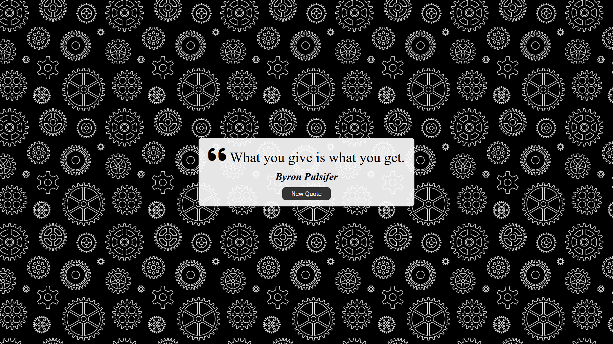

# <u>RANDOM QUOTE GENERATOR<u>

## About the project

In this project, i've build a random quote generator that displays a random quote to the user every time they press a button.
It's a simple web application using JavaScript. It helped me understand the interaction between JavaScript and an HTML document, and how they work together to display things on the web browser for people to see.

## For this project i used

## The project

